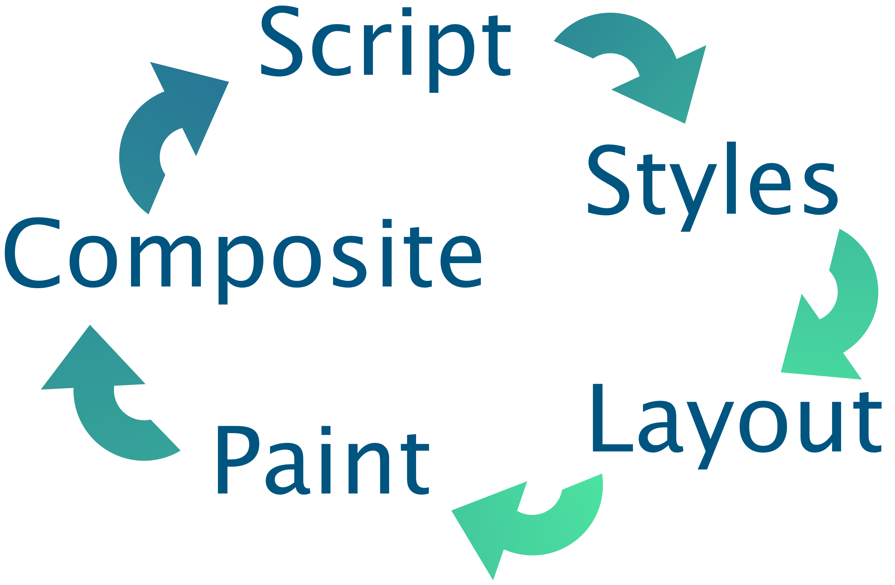
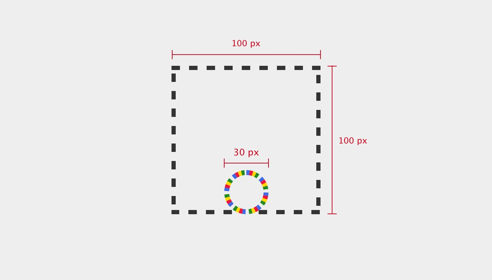

Being a student of both design and development it sort of makes sense that I would find the art of web animation so fascinating. As a discipline right on the border between the two, the freedom in shaping an intentful motion has to be tempered with knowledge of the browsers' abilities and limitations. The conflict can be frustrating to negotiate at times but also provides an engaging puzzle where the end result is likely not what was imagined in the beginning but has assumed a certain life of its own.

Or, perhaps all of that is just a vain attempt to rationalize the simple joy of making things go "swooosh" on your screen.

Whatever the case, animations are a lot of fun to work with and can, when designed and implemented with care, enhance the user experience significantly. Sometimes though developers seem to neglect good opportunities to animate because they are unsure how to do it. Or, even worse, they might implement the animation but disregard any attempt at performance.

In this article, we will explore some technical considerations imposed by our medium  -  the browser  -  in an attempt to demystify why certain animations perform better than others. More specifically, we will investigate how web browsers render elements to the screen and what this means for your animations.

So grab your hot beverage of choice, and get ready for a crash course of the render pipeline.

## The Render Pipeline

> The five steps of the render pipeline: Script, Styles, Layout, Paint and Composite

Let us take a moment to appreciate just how fast computers are. Whether you are reading this on a computer or a phone its screen is likely refreshing at a rate of 60 times per second  -  allowing each refresh a diminutive ~16 milliseconds to calculate and perform its updates. Any longer than that and you end up with janky movement in your animations. Even at the breakneck speeds of modern computing it's still a pretty tiny needle to thread.

In order to have delightfully animated and interactive pages, it is our job as developers to help the computer minimize the effort involved in updating the screen at each step, and this is much easier to do if you understand the work involved in rendering.

## Step 1: Script

`gist:dnjstrom/806543b1e776d8b40d53ba8722caae8c#script.js`

> The necessary elements of a spinner component is created and assigned classnames.

The first thing that happens in each cycle is that any pending javascript is run. Anything really can happen at this point  -  elements can be added or removed from the DOM, styles or classes modified and element states, like hover, can change. Updates due to CSS Animations or transitions are also part of this stage.

The overwhelming freedom at this point makes it difficult for the computer to automatically optimize the code, however, depending on the situation there are a lot of optimizations you can do as a developer.

### Avoid heavy computations

Maybe you can make sure the collection of posts are pre-sorted on the server.

### Offload heavy computations

Any long-running calculations that can not be avoided should be performed in a separate thread using Service Workers to avoid slowing down rendering.

### Avoid unnecessary DOM modifications

Using a shadow DOM can help minimize the necessary changes.

### Prefer CSS Animations

Their updates are automatically run in a separate thread. Next up in preference should be the Web Animation API and lastly reserve animating with regular javascript as a last resort (if at all).

### Avoid blocking javascript

When doing api calls or reading files from disk, make sure to use callbacks or promises rather than synchronous functions.

### Use requestAnimationFrame

To limit frequent updates to a reasonable rate for the given device.

## Step 2: Styles

`gist:dnjstrom/dd7a7358968dc50fb1ac945c56c15622#style.css`

> Some styles are applied to the body and other elements.

With all dynamic updates calculated it is time to inspect our stylesheets to determine what styles should be applied to what elements. This task is much more well defined than the Script stage which means the browser can be quite smart about how to optimize it. Still, there are things we can do to help it along.

### Minimize the number of selectors

Remove styles that are not relevant to the current page.

### Avoid universal selectors

Selectors like `*` or `[type="url"]` has to be checked for all elements which can add up to a hefty performance cost.

### Avoid the descendant selector

With a selector like `.article p`, all parents of each p tag has to be checked in order to determine if it matches. Use shallow selectors, like `.article > p`, whenever possible.

### Use classes

While a rule like li:nth-child(odd) has a certain elegance, from a performance standpoint it would make more sense to just add a class `.odd-row` to all odd rows.

Preferably, rules should be written so it is quick to determine if it does not apply to a given element. Rules are matched right to left, so a rule like `div .button` is more performant than `.button div` since with the latter the `.button` parent has to be checked for all `div` elements, but in the former the `div` parent only has to be checked for `.button` class elements  -  of which there are likely far fewer.

## Step 3: Layout

`gist:dnjstrom/06ffc937d83c75cde434c545c75130bf#layout.css`

> The elements of our spinner are laid out on the page and given dimensions.

So far we have mostly sorted out what elements there are and their corresponding styles, but at this stage we are ready to start figuring out what element goes where on the page and what size it should be.

> The spinner elements as the browser knows them during the layout phase.

Properties like `position`, `width`, `margin` and `display` all affect how an element is laid out in the page. Many of these, such as increasing an element's height, also affect the layout of elements further down the page as it pushes on them. Consequently these properties tend to be costly to update since you almost always end up updating other elements as well. For animation they should really be avoided as much as possible. Try instead to implement your motion using only Composite-level properties that are much more efficient (more on this later).

## Step 4: Paint

`gist:dnjstrom/8c2f3defeea6dc4cbd7413c0ca14262a#paint.css`

> Colors are assigned to the individual balls and each is promoted to a separate layer.

Having determined where each element goes on the page, the browser starts filling in the content of each block. Paint properties like `background-color` are generally much more performant than layout properties, but things with a blur  -  such as shadows  -  are more demanding to paint than regular colors or images. The most effective optimization at this stage is simply to limit the size of the area that is repainted throughout the animation.

If you have part of the page changing more often than others it might also prove worthwhile to promote this element to its own layer. By specifying `will-change: transform` (or `transform: translateZ(0)` for older browsers) the element gets extracted onto a separate layer where it can easily be modified individually from the rest of the document. If you have ever worked with graphics software, like Photoshop or Gimp, this should feel familiar.

> In the Chrome Dev Tools' layer panel, we can confirm the balls are on separate layers.

Take note though that each layer incurs a cost in terms of memory and computational overhead so make sure the extraction actually makes your animation more performant overall.

## Step 5: Composite

`gist:dnjstrom/5d9a419ea96f6c06df96a3822fc62f69#composite.css`

> We're using transform to create a rotating animation - taking advantage of GPU-acceleration.

The final step of the rendering pipeline is to combine the different layers into a single view for the screen, possibly with some manipulation of the layers first. The properties at this step, `transform` and `opacity`, are by far the most performant ones since they do not cause updates in any other render step and can be performed at blazing speeds on the GPU. The element first has to be moved to a separate layer (using `will-change`) in order for the performance benefits of hardware acceleration to be applicable though.

Counter-intuitively, it is more performant to rotate an element in 3D than it is to change its margin. Again though, make sure the benefits of making another layer outweighs the overhead.

## Putting it all together

`gist:dnjstrom/c5885b55b6443b6a0625b7e76ba478a4#putting-it-all-together.css`

> Assigning the spin animation is the last step necessary to complete our spinner. We also add some animation delay for each ball to make the overall motion more interesting.

As we have seen, each step in the pipeline has implications for what choices to make when animating but also necessitates updates in each subsequent step of the pipeline. As such it is better to try and keep changes towards the end of the pipeline in order to avoid cascading updates.

See the Pen <a href="https://codepen.io/dnjstrom/pen/zmmoKd/">Spinner</a> by Daniel Ström (<a href="https://codepen.io/dnjstrom">@dnjstrom</a>) on <a href="https://codepen.io">CodePen</a>.

> Our completed, highly performant, spinner - in all its glory.

Now more familiar with the five steps of the render pipeline, my hope is that exploring web animations will feel more approachable and fun to you, and for the guidelines above to provide a framework for safe exploration. Together, we should put animation to use in making the web more user friendly and delightful  -  in aesthetics as well as performance.

Finally, while this article does not really touch on tooling, anytime you are working with performance it is absolutely crucial to measure and validate the optimizations applied, and there is a bunch of tooling to help you. Check out the recommended reading for more on that and other brilliant resources.

## Further reading

The venerable Nielsen Norman Group has compiled a lot of interesting data on how to use animation to support the user experience.

* https://www.nngroup.com/articles/animation-usability/

Google has written an abundance of great articles on the topic of animation, ranging from UX to performance and tooling.

* http://jankfree.org/
* https://developers.google.com/web/fundamentals/design-and-ux/animations/
* https://developers.google.com/web/fundamentals/performance/rendering/
* https://csstriggers.com/

Anna Migas amazing talk on animation performance at Nordic.js was the primary inspiration that got me writing this article.

* https://twitter.com/szynszyliszys/status/1037668518999846912
